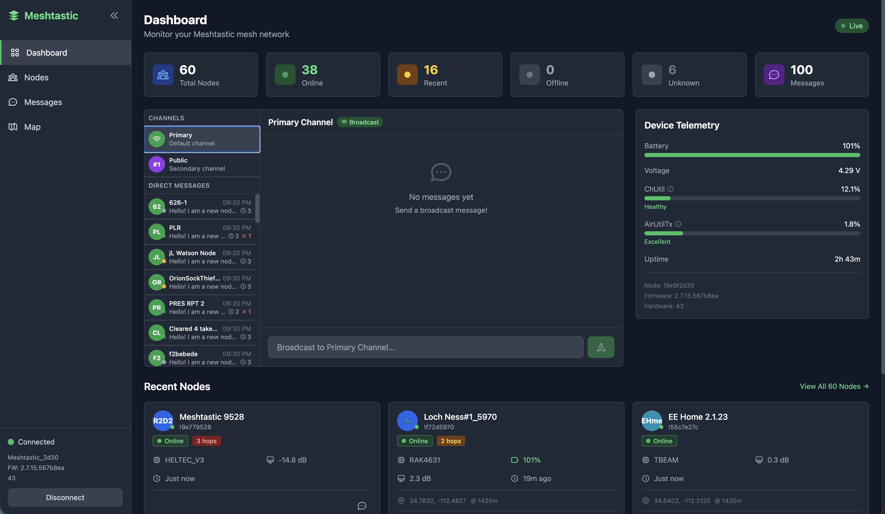

# Meshtastic Web Dashboard

A real-time web dashboard for monitoring and interacting with your Meshtastic mesh network via Bluetooth Low Energy (BLE).



## Features

### Real-Time Monitoring
- **Node Discovery** - See all nodes in your mesh network with status indicators (online, recent, offline)
- **Live Telemetry** - Battery level, voltage, channel utilization, and air utilization metrics
- **Position Tracking** - View nodes on an interactive map with their GPS positions
- **Message History** - Track all messages across channels and direct messages

### Device Telemetry
- **ChUtil (Channel Utilization)** - Monitor shared airtime usage on your channel
- **AirUtilTx** - Track your device's transmission airtime usage
- **Battery Monitoring** - Real-time battery level and voltage
- **Uptime Tracking** - See how long your device has been running

### Messaging
- **Channel Messages** - Send and receive messages on mesh channels
- **Direct Messages** - Private messaging to specific nodes
- **Delivery Confirmation** - ACK/NAK tracking for sent messages

### Interactive Map
- **Dark Theme Map** - Easy on the eyes with Stadia Maps dark tiles
- **Node Markers** - Color-coded by hop count (direct, 1-2 hops, 3-4 hops, 5+ hops)
- **Status Indicators** - Pulsing indicators show online/offline status
- **Quick Actions** - Message nodes directly from the map
- **Traceroute Visualization** - See the path your messages take through the mesh
- **Altitude Display** - View node elevation in both meters and feet

### Traceroute
- **Route Discovery** - Trace the path to any node in your mesh
- **Hop Visualization** - See intermediate nodes on the map
- **SNR Data** - View signal-to-noise ratios along the route
- **Timeout Handling** - Graceful handling of unreachable nodes

### Node Information
- **Quick Info Modal** - Click info icon to see detailed node data
- **Live Status** - Online/offline status with last heard time
- **Hardware Info** - Device model, battery level, signal strength
- **Location Data** - GPS coordinates with altitude

### Live Console
- **Real-Time Events** - View all WebSocket messages from your device as they happen
- **Expandable Data** - Explore nested JSON data like browser dev tools
- **Event Filtering** - Filter by event type (message, position, telemetry, etc.)
- **Pause/Resume** - Freeze updates to inspect data without it scrolling away
- **Dashboard Widget** - Quick view of recent events on the main dashboard

### Connection Management
- **BLE Device Scanning** - Scan for available devices with Meshtastic devices highlighted
- **Reconnect Button** - Quick disconnect/reconnect cycle without multiple clicks
- **BLE Reset** - Force cleanup of stuck BLE connections
- **Connection Recovery** - Helpful error messages showing available devices when connection fails

## Architecture

```
┌─────────────────┐     BLE      ┌──────────────────┐
│   Meshtastic    │◄────────────►│  Python Backend  │
│     Device      │              │   (FastAPI)      │
└─────────────────┘              └────────┬─────────┘
                                          │
                                   WebSocket + REST
                                          │
                                 ┌────────▼─────────┐
                                 │  Vue.js Frontend │
                                 │    (Vite)        │
                                 └──────────────────┘
```

- **Backend**: Python FastAPI server that connects to your Meshtastic device via BLE
- **Frontend**: Vue.js 3 SPA with Pinia state management
- **Database**: PostgreSQL for message and telemetry history
- **Real-time**: WebSocket for live updates

## Requirements

- Python 3.9+
- Node.js 18+
- PostgreSQL 14+
- A Meshtastic device with BLE support (e.g., Heltec V3, T-Beam, etc.)
- macOS or Linux (BLE support required)

## Quick Start

### 1. Clone the Repository

```bash
git clone https://github.com/anthonybo/meshtastic-dashboard.git
cd meshtastic-dashboard
```

### 2. Set Up the Database

```bash
# Create PostgreSQL database
createdb meshtastic
```

### 3. Configure Environment

```bash
# Copy example environment file
cp backend/.env.example backend/.env

# Edit with your settings
vim backend/.env
```

Update the `.env` file:
```env
DATABASE_URL=postgresql+asyncpg://yourusername@localhost:5432/meshtastic
MESHTASTIC_DEVICE_NAME=Meshtastic_XXXX
```

To find your device name, install the Meshtastic CLI and scan for devices:

```bash
# Install Meshtastic Python library
pip install meshtastic

# Scan for BLE devices
meshtastic --ble-scan
```

This will show available devices like `Meshtastic_a1b2`. Copy your device name to the `.env` file.

### 4. Install Dependencies

```bash
# Install all dependencies (backend + frontend)
npm install
```

### 5. Start the Application

```bash
# Start both backend and frontend
npm start
```

The dashboard will be available at `http://localhost:5173`

## Development

### Project Structure

```
meshtastic-dashboard/
├── backend/
│   ├── app/
│   │   ├── main.py           # FastAPI application
│   │   ├── config.py         # Configuration settings
│   │   ├── database.py       # Database connection
│   │   ├── models.py         # SQLAlchemy models
│   │   ├── schemas.py        # Pydantic schemas
│   │   ├── meshtastic_client.py  # BLE client
│   │   └── routers/          # API routes
│   ├── requirements.txt
│   └── .env.example
├── frontend/
│   ├── src/
│   │   ├── components/       # Vue components
│   │   ├── views/            # Page views
│   │   ├── stores/           # Pinia stores
│   │   └── App.vue           # Root component
│   ├── package.json
│   └── vite.config.js
├── docker-compose.yml        # Docker setup (optional)
└── package.json              # Root package.json
```

### Running in Development Mode

```bash
# Terminal 1: Backend with auto-reload
npm run start:backend

# Terminal 2: Frontend with HMR
npm run start:frontend
```

### Logging

Logs are written to `backend/logs/meshtastic_dashboard.log` with automatic rotation:
- Maximum file size: 5MB
- Keeps 1 backup file (total max 10MB)
- Clear labels: `[MSG]` for messages, `[ACK]` for acknowledgments

```bash
# View logs in real-time
tail -f backend/logs/meshtastic_dashboard.log
```

### API Endpoints

| Endpoint | Method | Description |
|----------|--------|-------------|
| `/api/connection/status` | GET | Get connection status |
| `/api/connection/connect` | POST | Connect to device |
| `/api/connection/disconnect` | POST | Disconnect from device |
| `/api/connection/reset` | POST | Reset BLE connection (force cleanup) |
| `/api/connection/scan` | GET | Scan for available BLE devices |
| `/api/nodes` | GET | Get all nodes |
| `/api/nodes/live` | GET | Get live node data from device |
| `/api/nodes/{id}/traceroute` | POST | Send traceroute to a node |
| `/api/messages` | GET | Get message history |
| `/api/messages` | POST | Send a message |
| `/api/messages/channels` | GET | Get available channels |
| `/ws` | WebSocket | Real-time updates |

## Telemetry Thresholds

### Channel Utilization (ChUtil)
| Range | Status | Description |
|-------|--------|-------------|
| < 25% | Healthy | Network has plenty of capacity |
| 25-40% | Moderate | Throttling begins |
| 40-50% | High | GPS updates reduced |
| > 50% | Congested | Investigate network issues |

### Air Utilization TX (AirUtilTx)
| Range | Status | Description |
|-------|--------|-------------|
| < 5% | Excellent | Great mesh citizen |
| 5-8% | Acceptable | Within limits |
| > 8% | Too High | Reduce transmissions |

## Privacy

This dashboard:
- **Does NOT** send any data to external servers (except map tiles for display)
- **Does NOT** include analytics or tracking
- **Does NOT** transmit your location (positions come from your device's existing settings)
- All data stays local between your browser, the backend, and your Meshtastic device

## Troubleshooting

### BLE Connection Issues

1. Ensure Bluetooth is enabled on your computer
2. Make sure no other app (like the Meshtastic phone app) is connected to the device
3. Use **Scan for Devices** to see available BLE devices and verify your device is visible
4. If connection gets stuck, use the **Reset BLE** button to force cleanup
5. Try the **Reconnect** button for a quick disconnect/connect cycle
6. Try power cycling your Meshtastic device
7. Check that the device name in `.env` matches exactly (use scan results to verify)

### Database Connection Issues

1. Ensure PostgreSQL is running: `brew services start postgresql` (macOS)
2. Verify the database exists: `psql -l | grep meshtastic`
3. Check the DATABASE_URL in your `.env` file

### Frontend Not Loading

1. Check that the backend is running on port 5001
2. Verify no CORS errors in the browser console
3. Try clearing browser cache and refreshing

## License

MIT License - see LICENSE file for details.

## Acknowledgments

- [Meshtastic](https://meshtastic.org/) - The amazing mesh networking project
- [Meshtastic Python Library](https://github.com/meshtastic/python) - BLE connectivity
- [Stadia Maps](https://stadiamaps.com/) - Dark theme map tiles
- [Leaflet](https://leafletjs.com/) - Interactive maps
